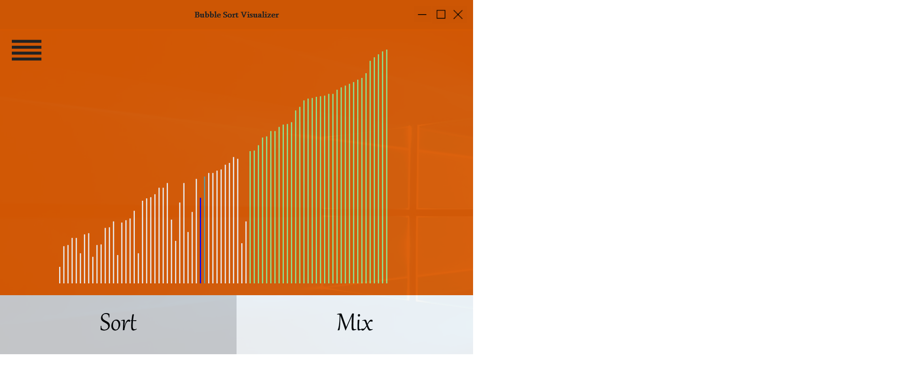
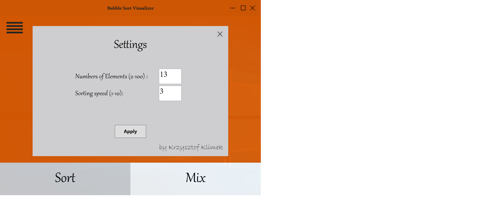
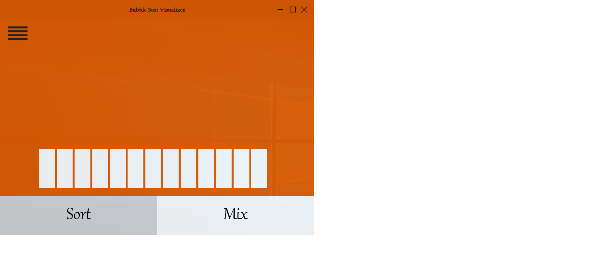
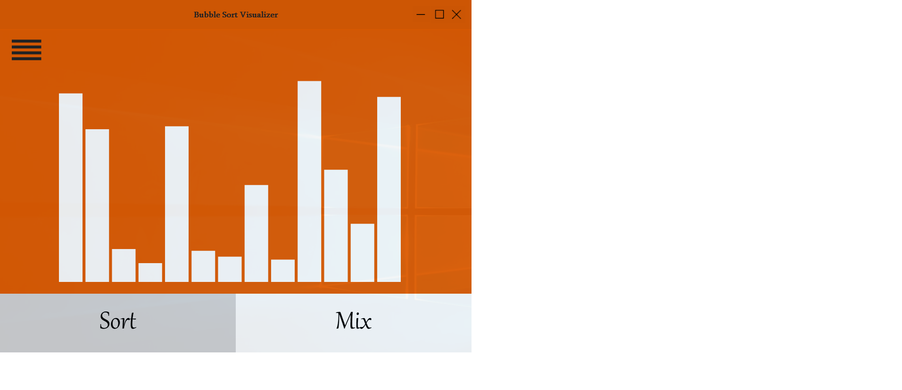
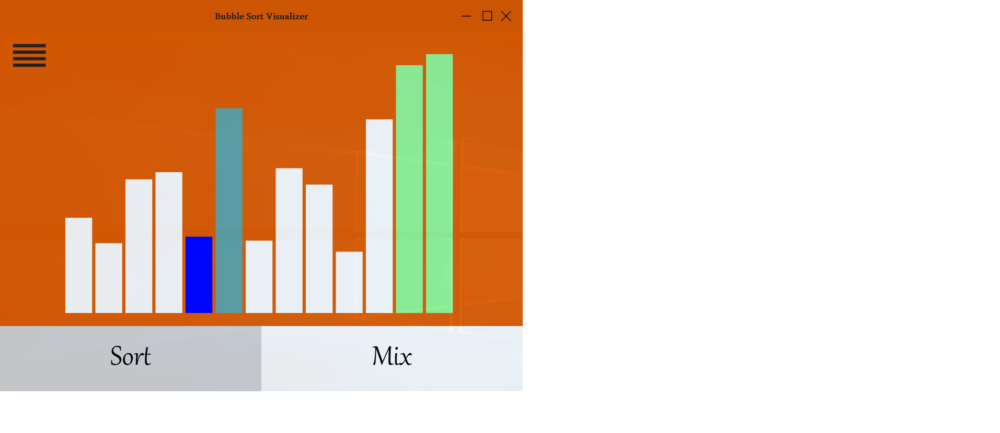

# BubbleSortingVisualizer_WPF

  This is application which symulate bubble sorting algorithm.
  

  
  

  In options we can change number of elements(2-100) and sorting speed (1-10)
  

  
  

  
  

     
  

  
  

   

  
  

   

  
  

   

  
  

  
  
